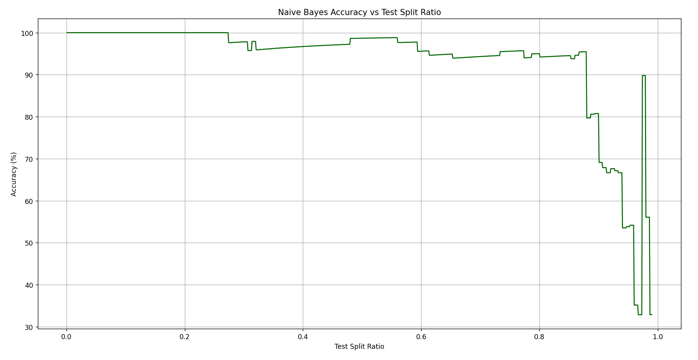

# Iris Naive Bayes Classifier

This project applies the **Gaussian Naive Bayes** classification algorithm to the classic **Iris dataset** using `scikit-learn`. The focus is on analyzing how **test/train split ratios affect model accuracy**.

---

## 📋 Features

- Uses **Gaussian Naive Bayes** (assumes normal distribution of features)
- Evaluates model performance over a wide range of **test/train split ratios**
- Plots **Split Ratio vs Accuracy**
- Predicts the class of a **custom flower sample**
- Displays a **classification report** and **confusion matrix** for detailed insights

---

## 📊 Results

Below is the plot showing how the split ratio impacts model accuracy on the Iris dataset:

- As expected, the model performs well across most splits, but due to dataset size and statistical nature, some variance is observed.

---

